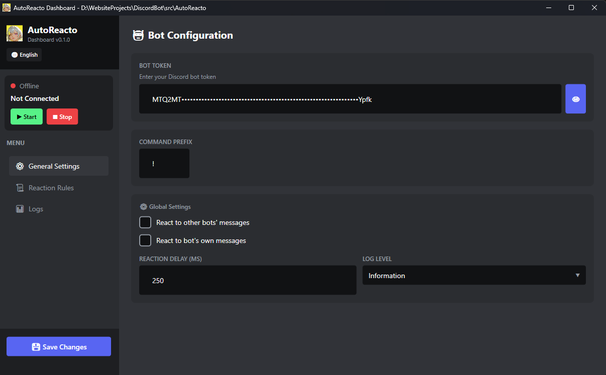
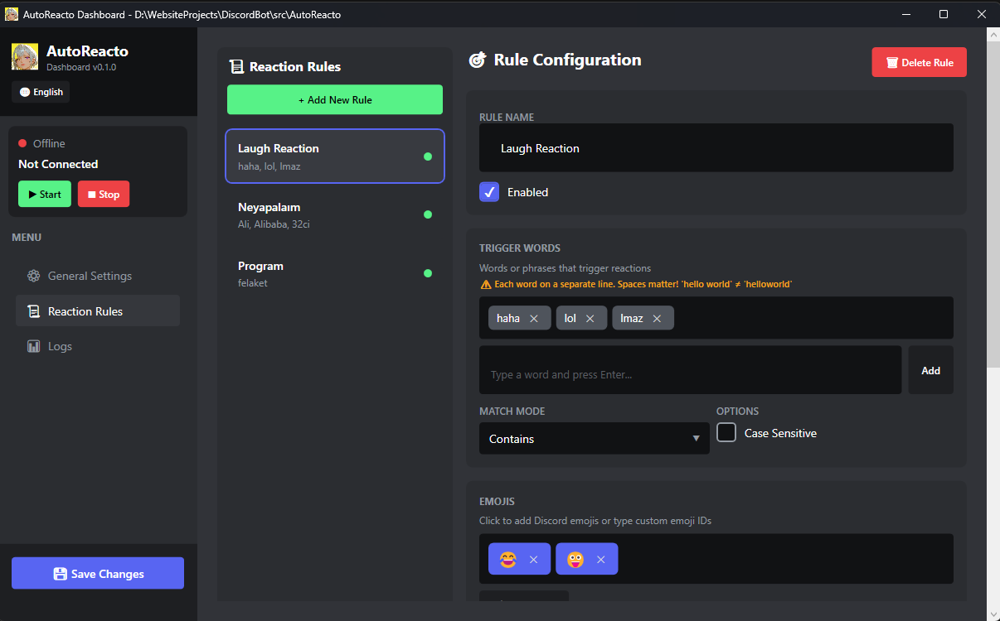
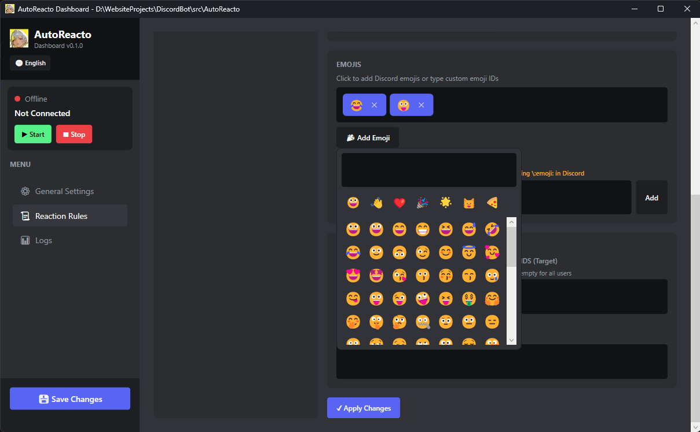
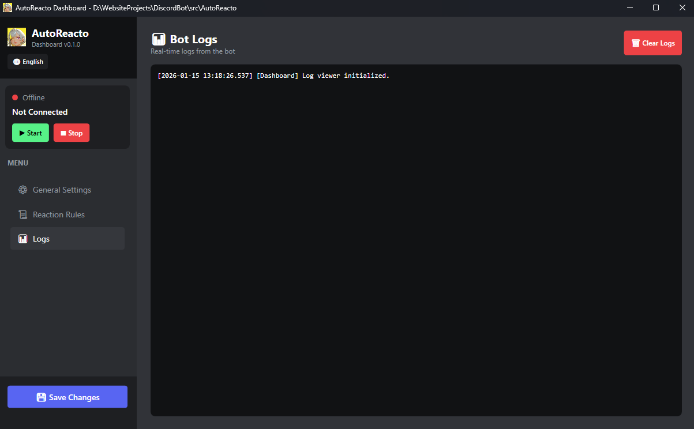

# 🤖 AutoReacto

[](https://dotnet.microsoft.com/)
[](https://github.com/discord-net/Discord.Net)
[](https://docs.microsoft.com/en-us/dotnet/desktop/wpf/)
[](LICENSE)

### 🇹🇷 Türkçe Açıklama

**AutoReacto**, C# diliyle geliştirilen, modüler ve yüksek performanslı bir Discord botudur. Sunucunuzdaki mesajlara otomatik emoji tepkileri ekler.

🖥️ **Yeni: WPF Dashboard!** Modern, Discord temalı bir arayüz ile botunuzu kolayca yönetin!

Sunucu yöneticileri, JSON tabanlı yapılandırma dosyası veya Dashboard üzerinden:
- Belirli kelimelere/ifadelere
- Belirli kanallara
- Belirli kullanıcılara

özel tepki kuralları tanımlayabilir.

### 🔧 Özellikler
- ✅ Kelime/regex bazlı otomatik emoji tepkisi
- ✅ Kanal bazlı filtreleme
- ✅ Kullanıcı bazlı hedefleme ve hariç tutma
- ✅ Çoklu eşleşme modları (Contains, Exact, StartsWith, EndsWith, Regex)
- ✅ Modüler ve genişletilebilir mimari
- ✅ Dependency Injection ile modern tasarım
- ✅ Serilog ile kapsamlı loglama (konsol + dosya)
- ✅ Rate limiting koruması
- ✅ Hot-reload yapılandırma desteği
- ✅ **WPF Dashboard** - Discord temalı modern arayüz
- ✅ **Çoklu dil desteği** (Türkçe/İngilizce)
- ✅ **Görsel emoji seçici** ile kolay kural oluşturma
- ✅ **Gerçek zamanlı log izleme**
- ✅ **Toast bildirimleri**

---

### 🇬🇧 English Description

**AutoReacto** is a modular, high-performance Discord bot developed in C# that automatically adds emoji reactions to messages in your Discord server.

🖥️ **New: WPF Dashboard!** Easily manage your bot with a modern, Discord-themed interface!

Server admins can define custom reaction rules through a JSON configuration file or the Dashboard targeting:
- Specific words/phrases
- Specific channels
- Specific users

### 🔧 Features
- ✅ Word/regex-based auto emoji reactions
- ✅ Channel-based filtering
- ✅ User-based targeting and exclusions
- ✅ Multiple match modes (Contains, Exact, StartsWith, EndsWith, Regex)
- ✅ Modular and extensible architecture
- ✅ Modern design with Dependency Injection
- ✅ Comprehensive logging with Serilog (console + file)
- ✅ Rate limiting protection
- ✅ Hot-reload configuration support
- ✅ **WPF Dashboard** - Modern Discord-themed interface
- ✅ **Multi-language support** (Turkish/English)
- ✅ **Visual emoji picker** for easy rule creation
- ✅ **Real-time log monitoring**
- ✅ **Toast notifications**

---

## 📁 Proje Yapısı / Project Structure

```
AutoReacto/
├── src/
│   ├── AutoReacto/                    # Discord Bot (Console App)
│   │   ├── Core/
│   │   │   ├── Extensions/            # DI ve extension methodlar
│   │   │   ├── Interfaces/            # Servis arayüzleri
│   │   │   └── Models/                # Veri modelleri
│   │   ├── Services/                  # İş mantığı servisleri
│   │   ├── Utils/
│   │   │   ├── Helpers/               # Yardımcı sınıflar
│   │   │   └── Logging/               # Loglama altyapısı
│   │   ├── Program.cs                 # Giriş noktası
│   │   └── config.json                # Bot yapılandırması
│   │
│   └── AutoReacto.Dashboard/          # WPF Dashboard Uygulaması
│       ├── Controls/                  # Özel WPF kontrolleri
│       │   ├── ConfirmDialog.xaml     # Onay dialogu
│       │   ├── EmojiPicker.xaml       # Emoji seçici
│       │   └── ToastNotification.xaml # Toast bildirimleri
│       ├── Localization/              # Çoklu dil desteği
│       ├── Themes/                    # Discord teması
│       ├── Views/
│       │   ├── MainWindow.xaml        # Ana pencere
│       │   └── Pages/                 # Sayfa görünümleri
│       │       ├── GeneralSettingsPage.xaml
│       │       ├── ReactionRulesPage.xaml
│       │       └── LogsPage.xaml
│       └── Utils/                     # Yardımcı araçlar
│
├── .gitignore
├── AutoReacto.sln
├── CHANGELOG.md
├── CONTRIBUTING.md
└── README.md
```

---

## ⚡ Hızlı Başlangıç / Quick Start

### Gereksinimler / Prerequisites
- [.NET 8.0 SDK](https://dotnet.microsoft.com/download/dotnet/8.0)
- Discord Bot Token ([Discord Developer Portal](https://discord.com/developers/applications))

### 1️⃣ Projeyi Klonla / Clone the Project
```bash
git clone https://github.com/asuna48/C-Sharp-AutoReacto.git
cd C-Sharp-AutoReacto
```

### 2️⃣ Bağımlılıkları Yükle / Install Dependencies
```bash
dotnet restore
```

### 3️⃣ Bot Token'ını Yapılandır / Configure Bot Token
`src/AutoReacto/config.json` dosyasını düzenleyin:
```json
{
  "token": "YOUR_BOT_TOKEN_HERE",
  ...
}
```

### 4️⃣ Botu Çalıştır / Run the Bot

**Konsol (Headless) modu:**
```bash
cd src/AutoReacto
dotnet run
```

**Dashboard (GUI) modu:**
```bash
cd src/AutoReacto.Dashboard
dotnet run
```

---

## 🖥️ Dashboard Özellikleri / Dashboard Features

### Türkçe
AutoReacto Dashboard, botunuzu görsel olarak yönetmenizi sağlar:

- **🎨 Discord Teması**: Discord'un karanlık temasına sadık modern arayüz
- **🌐 Çoklu Dil**: Türkçe ve İngilizce dil desteği
- **▶️ Bot Kontrolü**: Tek tıkla bot başlatma/durdurma
- **📋 Kural Yönetimi**: Görsel arayüz ile tepki kuralları oluşturma ve düzenleme
- **😀 Emoji Seçici**: Kategorilere ayrılmış emoji picker
- **📊 Canlı Loglar**: Gerçek zamanlı log izleme ve filtreleme
- **⚙️ Ayarlar**: Tüm bot ayarlarını görsel olarak yapılandırma
- **🔔 Toast Bildirimleri**: Başarı/hata bildirimleri

### English
AutoReacto Dashboard allows you to visually manage your bot:

- **🎨 Discord Theme**: Modern interface faithful to Discord's dark theme
- **🌐 Multi-Language**: Turkish and English language support
- **▶️ Bot Control**: One-click bot start/stop
- **📋 Rule Management**: Create and edit reaction rules with visual interface
- **😀 Emoji Picker**: Emoji picker organized by categories
- **📊 Live Logs**: Real-time log monitoring and filtering
- **⚙️ Settings**: Configure all bot settings visually
- **🔔 Toast Notifications**: Success/error notifications

---

## 📸 Ekran Görüntüleri / Screenshots

<p align="center">
  
  <br/>
  <em>Dashboard Ana Sayfa / Dashboard Home</em>
</p>

<p align="center">
  
  <br/>
  <em>Tepki Kuralları / Reaction Rules</em>
</p>

<p align="center">
  
  <br/>
  <em>Kural Düzenleme / Rule Editor</em>
</p>

<p align="center">
  
  <br/>
  <em>Canlı Log İzleme / Live Log Monitoring</em>
</p>

---

## ⚙️ Yapılandırma / Configuration

AutoReacto iki ayrı JSON dosyası kullanır:
- `config.json` - Bot ayarları ve token
- `emojis.json` - Tepki kuralları

### config.json

```json
{
  "token": "YOUR_BOT_TOKEN_HERE",
  "prefix": "!",
  "settings": {
    "ignoreBots": true,
    "ignoreSelf": true,
    "reactionDelayMs": 250,
    "maxReactionsPerMessage": 20,
    "logLevel": "Information"
  }
}
```

### emojis.json (Tepki Kuralları / Reaction Rules)

```json
{
  "reactionRules": [
    {
      "id": "hello-rule",
      "name": "Hello Reaction",
      "enabled": true,
      "triggerWords": ["hello", "hi", "merhaba"],
      "emojis": ["👋", "😊"],
      "channelIds": [],
      "userIds": [],
      "ignoreUserIds": [],
      "caseSensitive": false,
      "matchMode": "Contains"
    },
    {
      "id": "laugh-rule",
      "name": "Laugh Reaction",
      "enabled": true,
      "triggerWords": ["haha", "lol", "😂"],
      "emojis": ["😂", "😜"],
      "channelIds": [],
      "userIds": [],
      "ignoreUserIds": [],
      "caseSensitive": false,
      "matchMode": "Contains"
    }
  ]
}
```

### Eşleşme Modları / Match Modes

| Mod | Açıklama (TR) | Description (EN) |
|-----|---------------|------------------|
| `Contains` | Mesaj tetikleyici kelimeyi içeriyor | Message contains trigger word |
| `Exact` | Mesaj tam olarak eşleşiyor | Exact match |
| `StartsWith` | Mesaj tetikleyici ile başlıyor | Message starts with trigger |
| `EndsWith` | Mesaj tetikleyici ile bitiyor | Message ends with trigger |
| `Regex` | Regex pattern eşleşmesi | Regex pattern matching |

### Custom Emoji Kullanımı / Using Custom Emojis

Sunucunuzdaki özel emojileri kullanmak için:
```json
"emojis": ["<:customemoji:123456789012345678>"]
```

---

## 🔒 Discord Bot Ayarları / Discord Bot Settings

Discord Developer Portal'da botunuz için şu izinleri etkinleştirin:

### Privileged Gateway Intents
- ✅ **Message Content Intent** (Zorunlu / Required)

### Bot Permissions
- Read Messages/View Channels
- Add Reactions
- Read Message History

### OAuth2 Scopes
- `bot`
- `applications.commands` (isteğe bağlı / optional)

---

## 📊 Loglama / Logging

Loglar hem konsola hem de `logs/` klasörüne yazılır:
- Günlük rotasyon
- 30 gün saklama
- Yapılandırılabilir log seviyesi

```
[2024-01-15 10:30:45.123] [INF] [BotService] Bot connected as AutoReacto#1234
[2024-01-15 10:30:45.456] [INF] [BotService] Connected to 5 guild(s)
```

---

## 🏗️ Mimari / Architecture

Bot, modern .NET best practice'lerini takip eder:

- **Dependency Injection**: `Microsoft.Extensions.DependencyInjection`
- **Hosted Services**: `Microsoft.Extensions.Hosting`
- **Structured Logging**: `Serilog`
- **Interface Segregation**: Loose coupling için arayüzler
- **Single Responsibility**: Her servis tek bir sorumluluğa sahip

---

## 📌 Yol Haritası / Roadmap

- [x] Discord.Net ile temel bağlantı
- [x] JSON yapılandırma sistemi
- [x] Kelime bazlı tepki ekleme
- [x] Kanal ve kullanıcı filtreleri
- [x] Kapsamlı loglama
- [x] WPF Dashboard uygulaması
- [x] Çoklu dil desteği (TR/EN)
- [x] Görsel emoji seçici
- [x] Gerçek zamanlı log izleme
- [x] Toast bildirim sistemi
- [ ] Slash komutları desteği
- [ ] Veritabanı entegrasyonu
- [ ] Docker desteği

---

## 🤝 Katkıda Bulunma / Contributing

1. Bu repoyu fork edin
2. Feature branch oluşturun (`git checkout -b feature/amazing-feature`)
3. Değişikliklerinizi commit edin (`git commit -m 'Add amazing feature'`)
4. Branch'inizi push edin (`git push origin feature/amazing-feature`)
5. Pull Request açın

---

## 📄 Lisans / License

Bu proje MIT lisansı altında lisanslanmıştır. Detaylar için [LICENSE](LICENSE) dosyasına bakın.

---

## ⭐ Teşekkürler / Acknowledgments

- [Discord.Net](https://github.com/discord-net/Discord.Net) - Discord API wrapper
- [Serilog](https://serilog.net/) - Structured logging

---

**Made with ❤️ by [asuna48](https://github.com/asuna48)**
